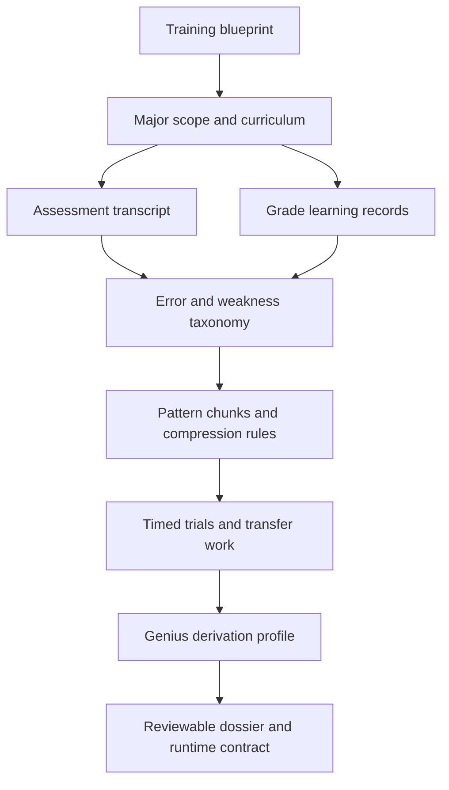

# Paideia Genius Derivation Engine

[](https://github.com/sinmb79/paideia-genius-derivation-engine/actions/workflows/ci.yml)

[한국어](README.md)

The Paideia Genius Derivation Engine treats narrow excellence as a training outcome, not a raw model-size claim. Within a bounded capacity, an agent can become unusually strong in a specific domain when its attention, chunks, timed practice, feedback, mistakes, and transfer work are repeatedly shaped by evidence.

This repository is a standalone extraction from Paideia-Agent. It does not perform network calls, store API keys, store OAuth tokens, or persist hidden chain-of-thought. It builds and validates a public-safe domain genius candidate profile from training curricula and reviewed evidence.

## Core Ideas

- Genius is a reviewable training contract, not a general superintelligence claim.
- Fixed-capacity efficiency can matter more than broad compute scaling for narrow expertise.
- External skills and other people's methods may be studied, but they are not promoted verbatim into the agent identity.
- Weaknesses and growth costs are preserved as résumé-like guardrails.
- A blueprint-only profile has top-level status `draft`.

## Flow



## Install

```powershell
py -3.12 -m pip install -e .
```

Runtime dependencies are standard-library only. For development checks:

```powershell
py -3.12 -m pip install -e ".[dev]"
```

## CLI

Create a draft:

```powershell
paideia-genius-profile build-profile `
  --blueprint .\examples\minimal_blueprint.json `
  --allow-draft `
  --output .\runs\draft_profile.json
```

Create an evidence-backed profile:

```powershell
paideia-genius-profile build-profile `
  --blueprint .\examples\minimal_blueprint.json `
  --curriculum .\examples\minimal_curriculum.json `
  --assessment-transcript .\examples\minimal_assessment_transcript.json `
  --growth-profile .\examples\minimal_growth_profile.json `
  --grade-learning-records .\examples\minimal_grade_learning_records.json `
  --reasoning-kibo .\examples\minimal_reasoning_kibo.jsonl `
  --output .\runs\sample_profile.json
```

Without `--allow-draft`, insufficient evidence produces an artifact but returns exit code `2`.

`validation.passed` means the training contract has enough minimum evidence to be valid; it does not prove genius. Longer-term criteria such as eight scored reviewed trials and an average score of 90 are checked by a separate `promotion` gate.

## Status Model

| Status | Meaning |
| --- | --- |
| `draft` | The blueprint is valid, but minimum training evidence is missing. |
| `training_contract_valid` | The profile is a minimum-evidence training contract, not proof of genius. |
| `genius_candidate_promoted` | The stricter long-term promotion gate passed: at least 8 scored reviewed trials, average score 90+, varied transfer, and documented weaknesses. |

`validation.contract_status` describes the minimum contract gate, such as `minimum_evidence_contract_passed`. `promotion.status` describes long-term genius candidate promotion.

## Python

```python
from paideia_genius_derivation import build_genius_derivation_profile

blueprint = {
    "schema": "ai-talent-training-blueprint/v1",
    "identity": {"name": "Mira", "language": "ko"},
    "track": {
        "track_id": "securities_research_phd",
        "name": "Securities Research PhD Track",
        "domains": ["valuation", "risk analysis"],
    },
}

profile = build_genius_derivation_profile(blueprint)
print(profile["validation"]["status"])
```

## Contract

See [docs/engine_contract.en.md](docs/engine_contract.en.md).

The library validates `identity.name`, `track.track_id`, and `track.domains` before profile construction. Passed assessments only count as reviewed evidence if they meet the assessment quality floor: `score >= 80` when a score is present, and all numeric `rubric_scores` are at least 20 when rubric scores are present.

## Public-Safe Rules

- No network calls.
- No hidden chain-of-thought storage.
- Raw reasoning kibo entries are not exported; only the entry count is reflected.
- Obvious provider tokens are replaced with `[redacted-sensitive-value]` before export.
- Raw external skill text is not promoted into the agent.

## Verification

```powershell
py -3.12 -m py_compile src\paideia_genius_derivation\genius_derivation.py src\paideia_genius_derivation\cli.py
py -3.12 -m unittest discover -s tests -v
py -3.12 -m bandit -q -r src -c pyproject.toml -f json -o runs\bandit_report.json
```

GitHub Actions runs compile, unittest, and Bandit scan on Python 3.10, 3.11, and 3.12.

## Research Basis

- Neural efficiency: <https://pubmed.ncbi.nlm.nih.gov/19580915/>
- Deliberate practice: <https://pubmed.ncbi.nlm.nih.gov/18778378/>
- Chunking expertise: <https://doi.org/10.1016/0010-0285(73)90004-2>
- Reflexion: <https://arxiv.org/abs/2303.11366>

## License

MIT License.
