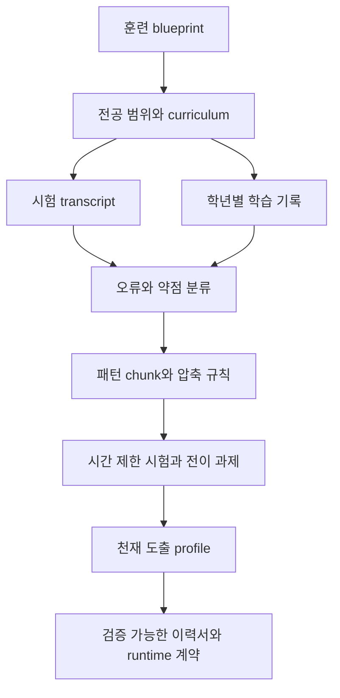
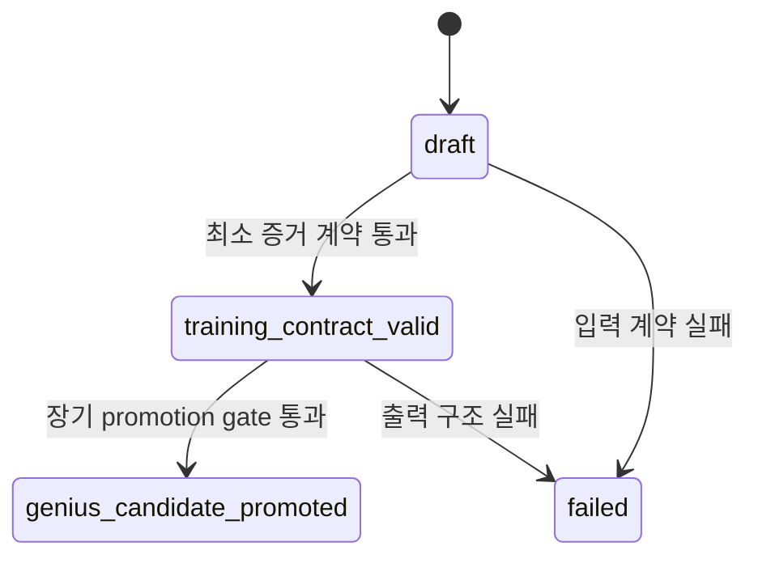

# Paideia 천재 도출 엔진

[](https://github.com/sinmb79/paideia-genius-derivation-engine/actions/workflows/ci.yml)

[English](README.en.md)

Paideia 천재 도출 엔진은 AI를 “더 큰 모델이면 더 똑똑해진다”는 방향으로만 보지 않습니다. 같은 한정된 용량 안에서도 무엇을 오래 훈련했고, 어떤 문제를 빨리 알아보고, 어떤 실패를 반복해서 고쳤는지에 따라 특정 분야에서 비대칭적인 전문성이 생긴다는 전제를 코드로 만든 독립 엔진입니다.

이 저장소는 Paideia-Agent 본체에서 분리한 standalone 패키지입니다. 네트워크 호출, API key 저장, OAuth 토큰 저장, hidden chain-of-thought 저장 없이, 교육과정과 시험/과제 증거를 바탕으로 “특정 전공 천재 후보 프로필”을 생성하고 검증합니다.

## v0.2.0 릴리스 요약

`v0.2.0`은 천재 후보 승격을 더 엄격하게 만든 validation hardening 릴리스입니다. 단순히 “증거가 조금 있다”는 이유로 천재 후보가 되지 않도록, 최소 훈련 계약과 장기 promotion gate를 분리했습니다.

### 주요 변경 사항

| 변경 | 왜 필요한가 |
| --- | --- |
| Profile 상태를 `draft`, `training_contract_valid`, `genius_candidate_promoted`로 분리 | 초안, 최소 계약 통과, 장기 승격을 혼동하지 않기 위해서입니다. |
| `validation.contract_status = minimum_evidence_contract_passed` 추가 | `validation.passed`가 천재 입증이 아니라 최소 증거 계약 통과임을 명확히 합니다. |
| 별도 `promotion` gate 추가 | 장기 시험 성과와 전이 증거를 독립적으로 검증하기 위해서입니다. |
| `scored_reviewed_trial_count >= 8` 필수화 | 과제 리뷰 수만 채워 단일 고득점 시험으로 승격되는 shortcut을 막습니다. |
| Assessment와 grade learning record 입력 검증 강화 | 깨진 입력이 조용히 증거로 계산되는 일을 막습니다. |
| Reasoning Kibo JSONL streaming 처리 | raw reasoning을 저장하지 않고 entry 수만 반영하기 위해서입니다. |

### Breaking Changes

기존 코드가 `profile["status"]` 값을 직접 비교했다면 수정이 필요할 수 있습니다.

| 기존 기대 | v0.2.0 이후 권장 |
| --- | --- |
| evidence-backed 결과가 바로 candidate status라고 가정 | `training_contract_valid`와 `genius_candidate_promoted`를 구분 |
| reviewed assignment 수를 promotion trial로 같이 계산 | `promotion["observed"]["scored_reviewed_trials"]` 확인 |
| `validation.passed`를 천재 입증으로 해석 | `validation`은 최소 계약, `promotion`은 장기 승격으로 분리 |

```python
status = profile["status"]
if status == "genius_candidate_promoted":
    run_promoted_agent_path(profile)
elif status == "training_contract_valid":
    keep_training(profile)
else:
    request_more_evidence(profile)
```

## 핵심 철학

- 천재성은 일반 초지능 선언이 아니라 검증 가능한 훈련 계약입니다.
- 모델 크기보다 중요한 것은 제한된 용량 안의 주의 배분, 패턴 chunking, 시간 제한 시험, 오류 수정, 전이 과제입니다.
- 외부 스킬이나 타인의 방법은 참고 자료일 뿐, 그대로 복사해 에이전트 정체성으로 승격하지 않습니다.
- 약점과 성장 비용은 숨기지 않고 이력서처럼 남겨야 합니다.
- 증거 없는 blueprint-only 결과물은 `draft` 상태입니다.

## 시스템 흐름



## 설치

```powershell
py -3.12 -m pip install -e .
```

런타임 의존성은 표준 라이브러리뿐입니다. 개발 검증에는 `pytest`, `bandit`를 선택적으로 씁니다.

```powershell
py -3.12 -m pip install -e ".[dev]"
```

## CLI 사용

증거 없는 초안을 만들 때:

```powershell
paideia-genius-profile build-profile `
  --blueprint .\examples\minimal_blueprint.json `
  --allow-draft `
  --output .\runs\draft_profile.json
```

검증 가능한 프로필을 만들 때:

```powershell
paideia-genius-profile build-profile `
  --blueprint .\examples\minimal_blueprint.json `
  --curriculum .\examples\minimal_curriculum.json `
  --assessment-transcript .\examples\minimal_assessment_transcript.json `
  --growth-profile .\examples\minimal_growth_profile.json `
  --grade-learning-records .\examples\minimal_grade_learning_records.json `
  --reasoning-kibo .\examples\minimal_reasoning_kibo.jsonl `
  --output .\runs\sample_profile.json
```

`--allow-draft`가 없고 훈련 증거가 부족하면 파일은 생성되지만 종료 코드는 `2`입니다. 이는 “실패”라기보다, 증거가 부족한 프로필을 자동으로 합격 처리하지 않기 위한 안전장치입니다.

`validation.passed`는 “천재 입증”이 아니라 최소 증거를 갖춘 훈련 계약 검증입니다. 점수가 있는 reviewed trial 8회, 평균 90점 같은 장기 기준은 별도 `promotion` gate가 검사합니다.

## 상태 체계



| 상태 | 의미 |
| --- | --- |
| `draft` | blueprint는 유효하지만 최소 훈련 증거가 부족합니다. |
| `training_contract_valid` | 최소 증거를 갖춘 훈련 계약입니다. 천재 후보 입증은 아닙니다. |
| `genius_candidate_promoted` | 장기 promotion gate를 통과했습니다. 8회 이상 scored reviewed trial, 평균 90점 이상, varied transfer, documented weakness가 필요합니다. |

`validation.contract_status`는 `minimum_evidence_contract_passed`처럼 최소 계약 검증 결과를 말하고, `promotion.status`는 장기 천재 후보 승격 여부를 말합니다.

### `genius_candidate_promoted` 최소 조건

| 조건 | 기준 |
| --- | --- |
| Base validation | `validation.passed is True` |
| Scored reviewed trials | `scored_reviewed_trial_count >= 8` |
| Average score | `assessment_average_score >= 90` |
| Varied transfer | 서로 다른 transfer evidence 2종 이상 |
| Weakness guardrail | 약점/오류 guardrail이 기록되어 있어야 함 |

## Python 사용

```python
from paideia_genius_derivation import build_genius_derivation_profile

blueprint = {
    "schema": "ai-talent-training-blueprint/v1",
    "identity": {"name": "Mira", "language": "ko"},
    "track": {
        "track_id": "securities_research_phd",
        "name": "Securities Research PhD Track",
        "domains": ["valuation", "risk analysis"],
    },
}

assessment_transcript = {
    "results": [
        {
            "gate_id": "valuation_case_report",
            "passed": True,
            "score": 92,
            "rubric_scores": {"evidence_precision": 24, "counterexample_depth": 23},
            "weak_spots": ["overfocus_on_downside"],
        }
    ]
}

growth_profile = {
    "schema": "paideia-growth-profile/v1",
    "asymmetry_profile": {
        "strength_biases": ["slow valuation patience"],
        "growth_costs": ["can overfocus on downside"],
    },
}

grade_learning_records = {
    "records": [
        {
            "education_stage": "doctoral_research",
            "assignments": [{"status": "completed_and_reviewed"}],
        }
    ]
}

profile = build_genius_derivation_profile(
    blueprint,
    assessment_transcript=assessment_transcript,
    growth_profile=growth_profile,
    grade_learning_records=grade_learning_records,
)

print(profile["status"])                         # training_contract_valid
print(profile["validation"]["contract_status"])  # minimum_evidence_contract_passed
print(profile["promotion"]["status"])            # not_ready
```

더 긴 예제는 `examples/basic_profile.py`와 `examples/promotion_gate_examples.py`를 보시면 됩니다.

## 입력 계약

상세 입력/출력 계약은 [docs/engine_contract.ko.md](docs/engine_contract.ko.md)를 보시면 됩니다. 상태 전이는 [docs/profile_lifecycle.ko.md](docs/profile_lifecycle.ko.md), promotion 조건은 [docs/promotion_gates.ko.md](docs/promotion_gates.ko.md), 검증 규칙은 [docs/validation_rules.ko.md](docs/validation_rules.ko.md)에 따로 정리했습니다.

최소 필수 입력은 `ai-talent-training-blueprint/v1` schema를 가진 blueprint입니다. 코드 레벨에서 `identity.name`, `track.track_id`, `track.domains`를 검증합니다. `passed` 검증을 받으려면 다음 중 충분한 훈련 증거가 필요합니다.

- curriculum manifest
- assessment transcript
- growth profile
- grade learning records
- `completed_and_reviewed` assignment 또는 quality floor를 통과한 passed assessment
- reasoning kibo JSONL의 entry count

Assessment는 `passed: true`만으로는 충분하지 않습니다. `score`가 있으면 80점 이상이어야 하고, `rubric_scores`가 있으면 각 numeric score가 20점 이상이어야 reviewed evidence로 계산됩니다.

## 공개 안전 규칙

- 네트워크 호출을 수행하지 않습니다.
- hidden chain-of-thought와 raw private reasoning trace를 저장하지 않습니다.
- reasoning kibo 입력은 원문을 저장하지 않고 entry 개수만 반영합니다.
- OpenAI/GitHub/Slack/Google 계열의 명백한 provider token 문자열은 출력 전 `[redacted-sensitive-value]`로 대체합니다.
- 외부 스킬 원문을 그대로 승격하지 않습니다.

보안 경계와 신고 방식은 [SECURITY.md](SECURITY.md), 릴리스 이력은 [CHANGELOG.md](CHANGELOG.md)를 보시면 됩니다.

## 검증

```powershell
py -3.12 -m py_compile src\paideia_genius_derivation\genius_derivation.py src\paideia_genius_derivation\cli.py
py -3.12 -m unittest discover -s tests -v
py -3.12 -m bandit -q -r src -c pyproject.toml -f json -o runs\bandit_report.json
```

GitHub Actions는 Python 3.10, 3.11, 3.12 matrix에서 compile, unittest, Bandit scan을 실행합니다.

## 연구 근거

- Neural efficiency: 같은 용량에서도 효율적이고 과제 중심적인 활성화가 중요할 수 있습니다. <https://pubmed.ncbi.nlm.nih.gov/19580915/>
- Deliberate practice: 구조화된 훈련, 피드백, 난이도 상승이 전문성 형성에 중요합니다. <https://pubmed.ncbi.nlm.nih.gov/18778378/>
- Chunking expertise: 전문가는 익숙한 패턴을 더 큰 검색 단위로 압축합니다. <https://doi.org/10.1016/0010-0285(73)90004-2>
- Reflexion: 언어적 피드백 기록은 weight update 없이도 다음 행동을 개선할 수 있습니다. <https://arxiv.org/abs/2303.11366>

## 라이선스

MIT License. Paideia-Agent에서 분리한 독립 공개 패키지입니다.
