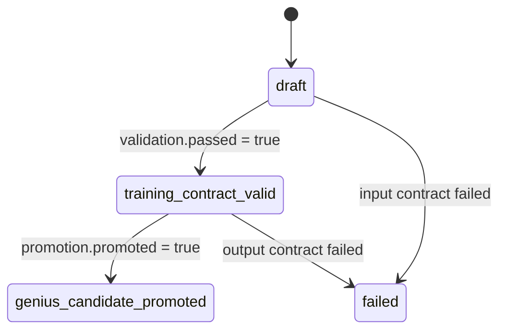

# Profile Lifecycle

[한국어](profile_lifecycle.ko.md)

A Paideia genius derivation profile does not become a genius artifact in one step. It starts from a blueprint, passes a minimum-evidence training contract, and only passes long-term promotion after enough repeated scored trials and transfer work.

## State Transition



## Status Meaning

| Status | Meaning | Next action |
| --- | --- | --- |
| `draft` | The blueprint is valid, but minimum training evidence is missing. | Add curriculum, assessment, and growth/grade evidence. |
| `training_contract_valid` | The minimum-evidence contract passed. It is not a genius promotion. | Keep running scored reviewed trials and updating weakness guardrails. |
| `genius_candidate_promoted` | The long-term promotion gate passed. | The runtime can use the promoted profile, while evidence and weaknesses continue to evolve. |
| `failed` | The input or output contract is broken. | Inspect `failed_checks` and `issues`, then fix the input. |

## Key Split

- `validation` checks the minimum training contract.
- `promotion` checks whether long-term repeated performance supports genius candidate promotion.
- `status` summarizes both gates as the top-level state.

## Migration Note

If older code treated any evidence-backed profile as a candidate, `v0.2.0` requires explicit branching.

```python
if profile["status"] == "training_contract_valid":
    schedule_more_scored_trials(profile)
elif profile["status"] == "genius_candidate_promoted":
    use_promoted_runtime_contract(profile)
```
