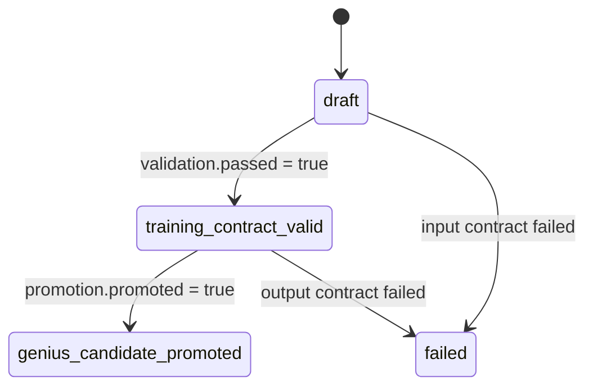

# Profile 생명주기

[English](profile_lifecycle.en.md)

Paideia 천재 도출 profile은 한 번에 “천재”가 되는 artifact가 아닙니다. 입력 blueprint에서 시작해, 최소 훈련 증거 계약을 통과하고, 반복 시험과 전이 과제를 충분히 쌓았을 때만 장기 promotion gate를 통과합니다.

## 상태 전이



## 상태별 의미

| 상태 | 의미 | 다음 행동 |
| --- | --- | --- |
| `draft` | blueprint는 유효하지만 최소 훈련 증거가 부족합니다. | curriculum, assessment, growth/grade evidence를 추가합니다. |
| `training_contract_valid` | 최소 증거 계약은 통과했습니다. 천재 후보 승격은 아닙니다. | scored reviewed trial을 반복하고 weakness guardrail을 갱신합니다. |
| `genius_candidate_promoted` | 장기 promotion gate를 통과했습니다. | runtime에서 promoted profile로 사용할 수 있지만, 약점과 evidence는 계속 갱신해야 합니다. |
| `failed` | 입력 또는 출력 계약이 깨졌습니다. | `failed_checks`와 `issues`를 확인해 입력을 수정합니다. |

## 핵심 구분

- `validation`은 최소 훈련 계약이 유효한지 봅니다.
- `promotion`은 천재 후보로 승격할 만큼 장기 반복 성과가 쌓였는지 봅니다.
- `status`는 두 결과를 종합한 top-level 상태입니다.

## 마이그레이션 주의점

기존 코드가 evidence-backed 결과를 곧바로 candidate로 보았다면 `v0.2.0` 이후에는 분기 처리가 필요합니다.

```python
if profile["status"] == "training_contract_valid":
    schedule_more_scored_trials(profile)
elif profile["status"] == "genius_candidate_promoted":
    use_promoted_runtime_contract(profile)
```
